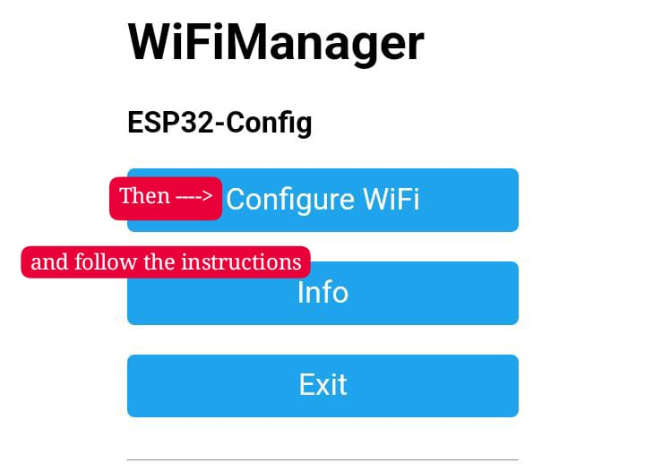

# ESP32 File Manager

ESP32 File Manager es una aplicación web que permite gestionar archivos en la memoria SPIFFS de un ESP32 a través de una interfaz web.

#### Antecedente

El ESP32 File Manager surgió de mi experiencia personal al trabajar con proyectos electrónicos que requerían el uso de la memoria SPIFFS del ESP32. 

Durante mi investigación, me encontré con varios métodos que resultaron ser poco prácticos o demasiado complejos de implementar. Algunos requerían versiones obsoletas del IDE Arduino, lo que podía causar problemas de compatibilidad y pérdida de configuraciones. Otras soluciones, basadas en Python, esp32tool o el framework ESP-IDF, no eran lo suficientemente intuitivas para mis necesidades.

Frustrado por la falta de una herramienta simple, decidí desarrollar este programa. El programa está diseñado para ser fácil de usar, compatible con versiones actuales del IDE Arduino, e intuitivo para usuarios con diversos niveles de experiencia. 

Quiero mencionar que a pesar de buscar en línea, no encontré un método similar a este, por lo que este proyecto es el resultado de mi propio trabajo (90%) con contribuciones de GPT (10%) (corrección de errores y optimización... y estoy seguro que me quedó código sin usar lol). 

Mi objetivo es proporcionar a la comunidad una solución accesible y funcional para gestionar archivos en la memoria SPIFFS del ESP32, evitando las complicaciones que yo mismo enfrenté.


## Características

- Interfaz web responsiva para gestionar archivos
- Importación de archivos a la memoria SPIFFS
- Exportación de archivos desde la memoria SPIFFS
- Eliminación de archivos
- Visualización del espacio de almacenamiento disponible
- Configuración Wi-Fi mediante WiFiManager
- Comandos de gestión de archivos a través del monitor serial

## Requisitos

- ESP32
- Arduino IDE (La versión que usé fue la 2.2.1, debería funcionar con versiones posteriores).

- Bibliotecas:
  - [WiFiManager](https://github.com/tzapu/WiFiManager)
  - [WebServer](https://github.com/espressif/arduino-esp32/tree/master/libraries/WebServer)
  - [SPIFFS](https://github.com/espressif/arduino-esp32/tree/master/libraries/SPIFFS)

## Instalación

1. Clona este repositorio o descarga los archivos.
   ```
   git clone https://github.com/MrPretendo/ESP32-File-Manager.git
   ```
2. Abre el archivo `ESP32_File_Manager.ino` en Arduino IDE.
3. Instala las bibliotecas necesarias, recomiendo importar el archivo comprimido en vez de usar el gestor de bibliotecas.
4. Selecciona tu placa ESP32 en el menú "Herramientas > Placa", yo usé "ESP32-WROOM-32" con el gestor "DOIT ESP32 DEVKIT V1".
5. Compila y carga el sketch en tu ESP32.

## Uso

### Configuración Wi-Fi

1. Al iniciar, el ESP32 creará un punto de acceso llamado "ESP32-Config". Busca esta red en tu dispositivo.

   

2. Conéctate a "ESP32-Config" con la contraseña `password`. Presiona la opción "Administrar router". Si no encuentras esta opción, intenta conectarte y luego acceder a la dirección IP del ESP32 (generalmente 192.168.4.1).

   

3. Verás la interfaz de WiFi Manager. Las instrucciones son detalladas e intuitivas. Para más información, consulta la documentación de la biblioteca `<WiFiManager.h>`.

   

4. Si el inicio de sesión fue correcto, la red "ESP32-Config" se cerrará y en su lugar iniciará "ESP32-AP".

   

5. Conéctate a "ESP32-AP" y selecciona "Administrar router" nuevamente. Si no tienes esta opción, accede usando la dirección IP del ESP32 en modo Access Point. Esta información se mostrará en el monitor serie de Arduino IDE.

   

### Acceso a la interfaz web

6. Si has seguido correctamente los pasos anteriores, deberías ver la siguiente interfaz web:

   

   Esta es la interfaz principal del ESP32 File Manager. Aquí podrás gestionar los archivos en la memoria SPIFFS de tu ESP32.

**Nota:** Este programa solo controla la gestión de archivos, cuando sea hora de usar tu proyecto principal, aquél que llamará a los archivos contenidos en SPIFFS, es importante desmarcar la opción "Erase All Flash (...)", de tenerla marcada borrará todo lo que esté dentro del ESP32 y tendrás que hacer el proceso de nuevo.


### Comandos del monitor serial

| Comando | Descripción |
|---------|-------------|
| `deploy` | Muestra la lista de archivos en SPIFFS |
| `delete [nombre_archivo]` | Elimina el archivo especificado |
| `memory` | Muestra la memoria disponible en SPIFFS |

## Contribuir

Las contribuciones son bienvenidas.

## Licencia

Este proyecto está bajo la Licencia MIT, modifíca y aporta todo lo que desees aportar, se agradecerá los créditos.

## Autor

Alejandro Arauz "Mr. Pretendo" - [GitHub](https://github.com/MrPretendo)

## Agradecimientos

- [Espressif](https://www.espressif.com/) por ESP32
- [tzapu](https://github.com/tzapu) por la biblioteca WiFiManager
- [Ivan Grokhotkov](https://github.com/igrr) por la biblioteca WebServer
- [Hristo Gochkov, Ivan Grokhtkov](https://github.com/igrr) por la biblioteca SPIFFS


---

Si el proyecto es útil para ti, considera darle una ⭐️, me ayudará a encontrar chamba.
